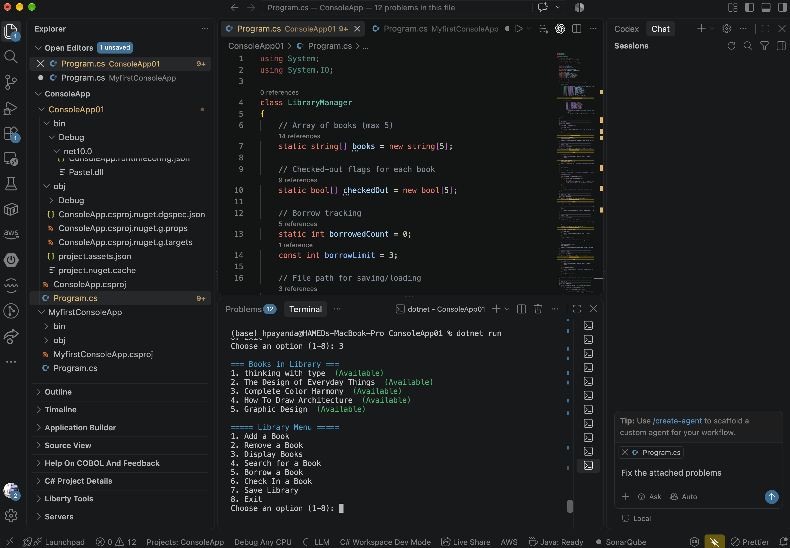
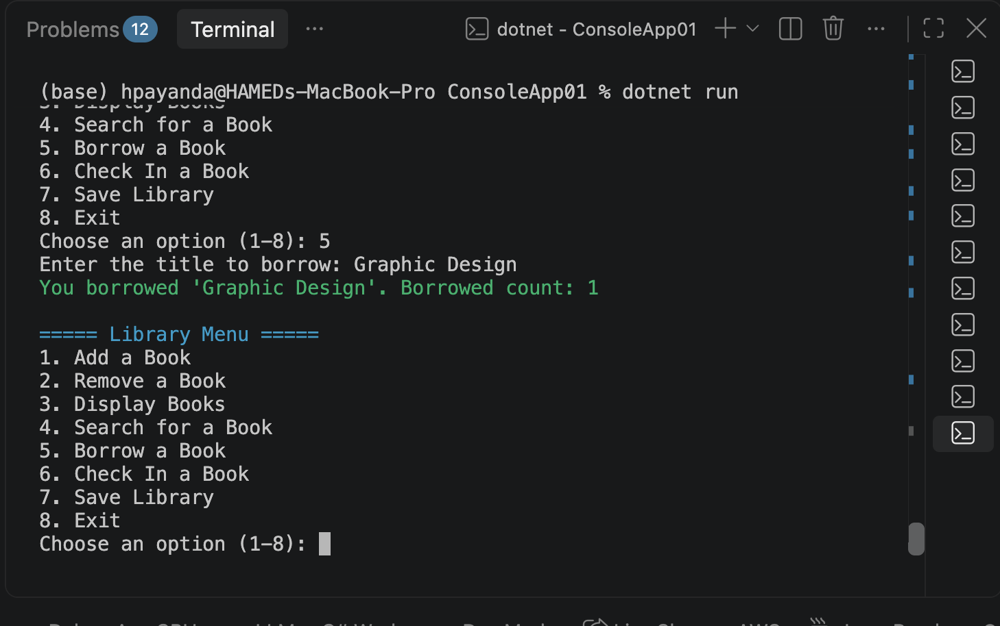
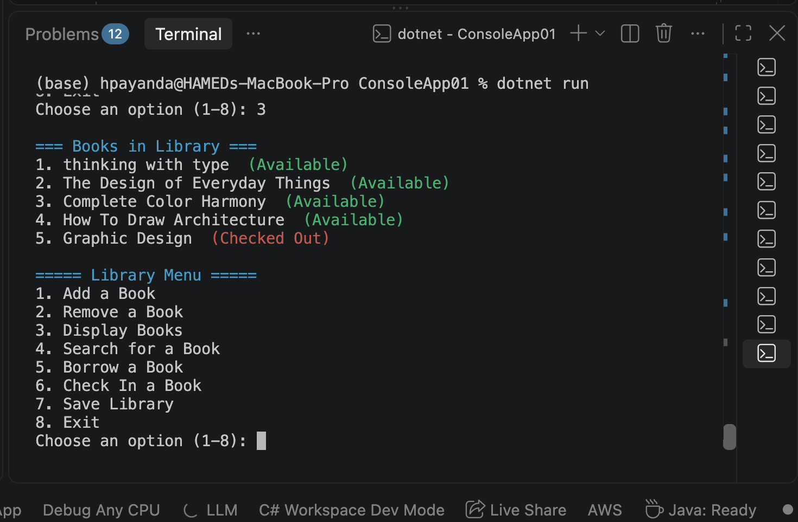
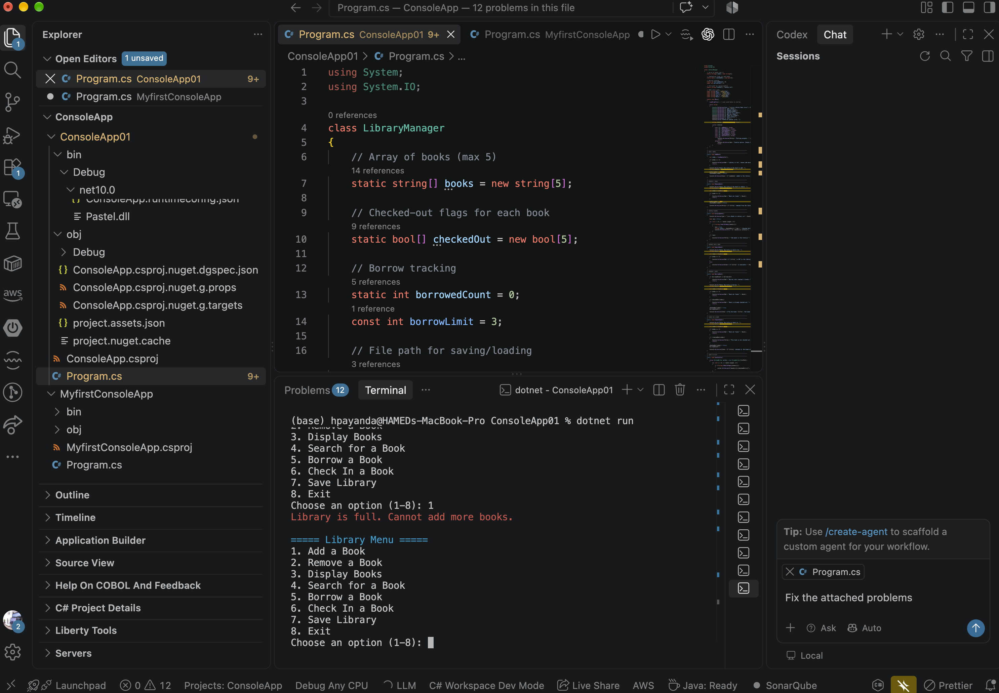
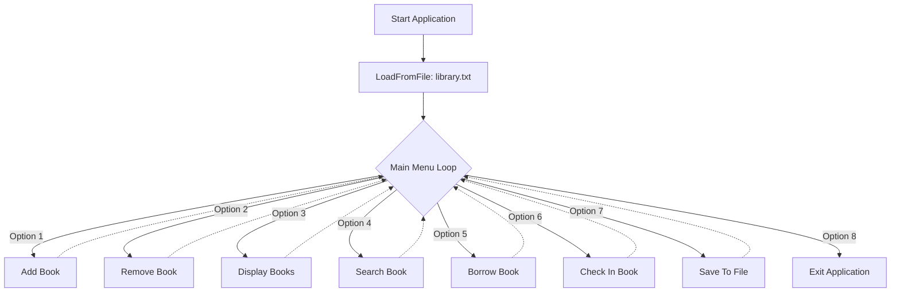

# 📚 C# Interactive Library Management System


A lightweight, interactive Command-Line Interface (CLI) application built in C# for managing a local library inventory. This project demonstrates core programming concepts including standard CRUD operations, array-based state management, persistent File I/O, and custom ANSI color rendering in the terminal.

---

## ✨ Key Features

* **Interactive CLI Menu:** A robust `while` loop implementation that processes user input dynamically.
* **Persistent Storage:** Reads and writes inventory data to a local `library.txt` file so data is never lost between sessions.
* **Smart Borrowing Logic:** Enforces a maximum borrow limit (3 books) and tracks individual book availability in real-time.
* **Search Functionality:** Quickly iterates through the inventory to locate specific titles.
* **Colorful ANSI UI:** Uses standard ANSI escape codes to provide color-coded visual feedback (e.g., Red for errors/checked-out, Green for success/available).

---

## 📸 Visual Proof

Here is a look at the application in action:

### Library Display & ANSI UI


### Borrowing & State Tracking

*Checking out "Graphic Design" successfully updates the borrow count.*


*The system instantly updates the book's status to "(Checked Out)".*

### Validation & Error Handling

*Safeguards prevent adding books beyond the fixed array limit.*

---

## 🏗️ Architecture & Flow

The application relies on synchronized parallel arrays (`string[] books` and `bool[] checkedOut`) to manage state, operating through a central menu loop.



---

## 💻 Core Tech Stack

•	Language: C#
•	Framework: .NET (v10.0)
•	Environment: Visual Studio Code / macOS
•	Data Storage: Local Text File (.txt using System.IO)

---

## 📂 Repository Structure
```text
📦 CSharp-Library-System
 ┣ 📜 Program.cs         # Core application logic and execution
 ┣ 📜 ConsoleApp.csproj  # .NET project configuration file
 ┣ 📜 library.txt        # Generated database file (created on save)
 ┣ 🖼️ screenshot1.png    # UI Showcase
 ┣ 🖼️ screenshot2.png    # UI Showcase
 ┣ 🖼️ screenshot3.png    # UI Showcase
 ┣ 🖼️ screenshot4.png    # UI Showcase
 ┣ 🖼️ screenshot5.png    # UI Showcase
 ┣ 🖼️ screenshot6.png    # UI Showcase
 ┗ 📜 README.md          # Project documentation
```

---

## 🚀 Local Setup & Execution
To run this application locally on your machine, ensure you have the .NET SDK installed.

1.	Clone the repository:
  ```bash
git clone [https://github.com/HAMED-PAYANDA/CSharp-Library-System.git](https://github.com/HAMED-PAYANDA/CSharp-Library-System.git)
```
2.	Navigate to the project directory:
```bash
cd CSharp-Library-System
```
3.	Run the application:
```bash
dotnet run
```
---

## 🧩 Code Highlight: ANSI Colors

To make the CLI visually distinct without relying on heavy external packages, the application uses ANSI escape sequences mapped to constants:
```csharp
// ANSI color codes for terminal formatting
const string Red = "\u001b[31m";
const string Green = "\u001b[32m";
const string Yellow = "\u001b[33m";
const string Cyan = "\u001b[36m";
const string Reset = "\u001b[0m";

// Example Usage:
Console.WriteLine(Green + $"'{newBook}' added to the library." + Reset);
```
